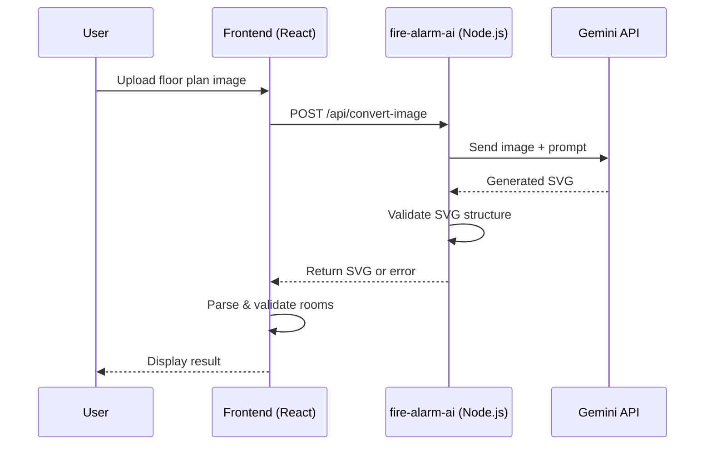

# AI Image Upload Service Architecture

This document describes the architecture for the AI-powered floor plan image-to-SVG conversion feature.

## Overview

The system allows users to upload floor plan images (PNG, JPG) which are converted to SVG format using Google's Gemini AI model. The generated SVG is structured for use with the Fire Alarm Simulator.



## Components

### Frontend (`all-sim-opus4`)

**File:** `src/components/ImportFloorPlanDialog.tsx`

- **Health Check**: On dialog open, pings `http://localhost:3002/health`
- **AI Image Tab**: Disabled if backend unavailable
- **Upload**: Sends image via `FormData` to backend
- **Validation**: Runs `importSVG()` on returned SVG

### Backend (`fire-alarm-ai`)

**Location:** `/Users/qixu/projects/evo/fire-alarm-ai/`

| File | Purpose |
|------|---------|
| `src/index.ts` | Express server, `/api/convert-image` endpoint |
| `src/gemini.ts` | Gemini API wrapper |
| `src/validator.ts` | SVG structure validation |
| `src/prompt.ts` | Conversion instructions for AI |

### API Endpoints

| Method | Endpoint | Description |
|--------|----------|-------------|
| GET | `/health` | Health check, returns `{ status: "ok" }` |
| POST | `/api/convert-image` | Accepts image file, returns SVG |

## Data Flow

1. **Image Upload** → `multipart/form-data` with `file` field
2. **AI Processing** → Image sent to Gemini with structured prompt
3. **SVG Generation** → AI outputs SVG with `data-room-*` attributes
4. **Validation** → Backend checks for required room attributes
5. **Response** → `{ success: true, svg: "...", roomCount: N }`

## Configuration

### Environment Variables (`.env`)

```
GEMINI_API_KEY=your_api_key_here
PORT=3002
```

### Model Selection

Currently using: `gemini-3-pro-preview`

Available models (confirmed):
- `gemini-3-pro-preview` ✅
- `gemini-3-flash-preview` ✅
- `gemini-2.0-flash-exp` ✅

## Error Handling

| Scenario | Frontend Behavior |
|----------|-------------------|
| Backend offline | AI button disabled, tooltip shown |
| API key invalid | Error message displayed |
| SVG validation fails | Validation errors listed |
| Network error | "Failed to connect" message |
