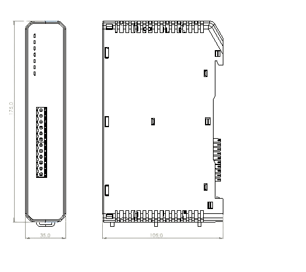

# Unified Module Case Design

## Overview

All panel modules share a **unified plastic case design**. The hardware uses identical enclosures for all module types - only the **front connector panel** differs between modules.

## Technical Specifications

### Case Dimensions
| Dimension | Value |
|-----------|-------|
| Width | 35mm |
| Depth | 105mm |
| Height | 125mm |

### Common Features (All Modules)
- White/light gray plastic housing
- Ventilation slots on top surface
- DIN rail mounting clip on back
- Uniform height and width
- Snap-fit mounting mechanism

### Front Panel Variations by Module Type

| Module Type | Front Panel Features |
|-------------|---------------------|
| **Controller** | 12-pin green terminal block, 4 status LEDs (Power, Alarm, Fault, Comm) |
| **Loop Driver** | 8-pin green terminal block for loop connections, 1 status LED |
| **Power Module** | Dual terminal blocks: INPUT (3-pin mains), OUTPUT (3-pin 24V DC) |
| **I/O Module** | 16-pin terminal blocks (8 inputs + 8 outputs), 1 status LED |

## UI Representation

When rendering modules in the panel inside view:
1. All modules should have **identical case/housing shape**
2. Only the **front face** (connector panel) should differ
3. Modules mount on standard DIN rails in the enclosure
4. Empty slots show dashed outline with "+" add icon

## Color Scheme

| Element | Color Code |
|---------|------------|
| Module case | `#F9FAFB` (off-white) |
| Ventilation slots | `#E5E7EB` (light gray lines) |
| Terminal blocks | `#10B981` (emerald green) |
| Status LED (on) | `#22C55E` (green) |
| Status LED (fault) | `#EF4444` (red) |
| Module labels | `#374151` (dark gray text) |
